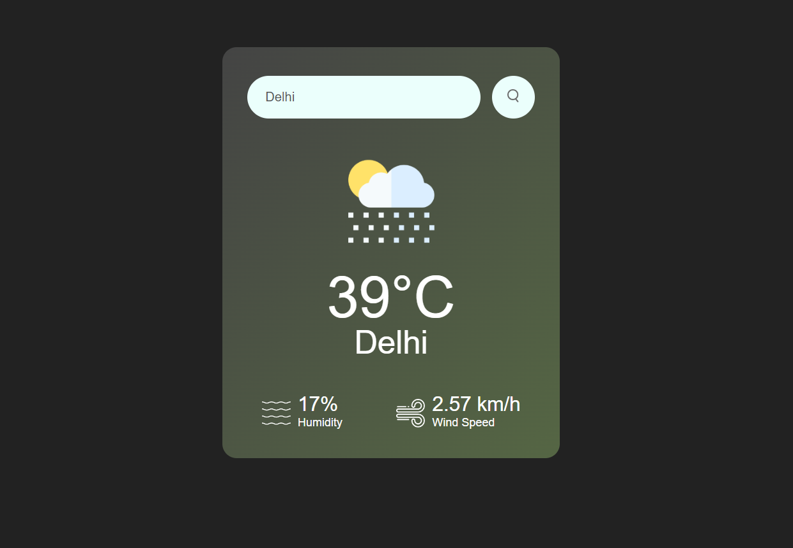

# 🌤️ Weather App ☔

Welcome to the Weather App! 🌍 A simple yet powerful application to fetch and display current weather information for any city around the world. Powered by the OpenWeatherMap API and featuring a user-friendly interface with a guided tour.

## 🌟 Features

- 🔍 **Search**: Find weather info by city name.
- 🌡️ **Temperature**: Display current temperature in Celsius.
- 💧 **Humidity**: See the humidity level.
- 🌬️ **Wind Speed**: Check out the wind speed.
- 🎨 **Modern Design**: Sleek and user-friendly interface.
- 🚀 **Guided Tour**: A friendly tour to help you navigate the app.

## 📸 Screenshots



## 📷 Demo

[](https://www.youtube.com/watch?v=vjH1UGa8CmA)

## 🛠️ Technologies Used

- ⚛️ **HTML**
- 🎨 **CSS**
- 📜 **JavaScript**
- 🌐 **OpenWeatherMap API**
- 🧙‍♂️ **Shepherd.js** (for the guided tour)

## 📦 Installation

1. Clone the repository:
    ```bash
    git clone https://github.com/your-username/weather-app.git
    ```
2. Navigate to the project directory:
    ```bash
    cd weather-app
    ```
3. Open `index.html` in your favorite web browser.

## 🚀 Usage

1. Enter the name of a city in the search box. 🏙️
2. Click the search button to fetch the weather details. 🔍
3. Voila! 🌟 See the current weather, temperature, humidity, and wind speed.
4. If you enter an invalid city name, an error message will pop up. 🚫
5. Take the guided tour to learn about the app's features. 🎉

## 🔑 API Key

Replace the `apiKey` variable in the JavaScript with your own API key from OpenWeatherMap.

```javascript
const apiKey = "YOUR_API_KEY_HERE";
```

Get your API key by signing up at [OpenWeatherMap](https://home.openweathermap.org/users/sign_up).

## 📜 License

This project is licensed under the MIT License.

## 🙌 Acknowledgements

- 🌐 [OpenWeatherMap](https://openweathermap.org/) for the weather API.
- 🧙‍♂️ [Shepherd.js](https://shepherdjs.dev/) for the awesome guided tour.

## 🤝 Contributing

Contributions are welcome! Open an issue or submit a pull request for any improvements or suggestions. Let's make this app even better together! 🌟

